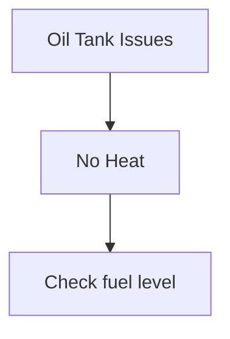

# Phase 1: HVAC_ideas Skills Implementation Plan

## Overview

**Location**: `/Users/sergevilleneuve/Documents/MyExperiments/HVAC_ideas`
**Timeline**: Week 1 (16 hours estimated)
**Skills to Create**: 8 skills
**Status**: ✅ COMPLETED (2026-01-16)

**CRITICAL LESSON LEARNED**: Skills must follow **MCP Orchestrator Pattern** - they orchestrate MCP tools via protocol, NEVER access data directly.

---

## 8 HVAC Skills Implemented

| # | Skill Name | Purpose | Pattern | Files |
|---|------------|---------|---------|-------|
| 1 | **hvac-diagnostic** | Run Tank 1/2 diagnostics with AI or basic mode | Wrapper | 3 files |
| 2 | **hvac-mcp** | Manage MCP server lifecycle | Server Control | 2 files |
| 3 | **hvac-todo** | Task management via MCP tools | **MCP Orchestrator** | 1 file |
| 4 | **hvac-reminder** | Timed reminders via MCP tools | **MCP Orchestrator** | 1 file |
| 5 | **hvac-agent** | Multi-agent workflows (logs, Reddit) | Workflow | 2 files |
| 6 | **hvac-setup** | Environment validation and setup | Validator | 2 files |
| 7 | **hvac-mindmap** | Mind mapping via MCP tools | **MCP Orchestrator** | 1 file |
| 8 | **hvac-report** | Generate PDF diagnostic reports | Report Gen | 3 files |

**Total Files Created**: 15 files (3 fewer than planned - MCP orchestrators don't need Python scripts)

---

## Directory Structure (Actual - Implemented)

```
HVAC_ideas/
├── .claude/
│   └── skills/
│       ├── hvac-diagnostic/           # Wrapper for diagnostic scripts
│       │   ├── SKILL.md
│       │   ├── scripts/
│       │   │   └── diagnostic-runner.sh
│       │   └── references/
│       │       └── diagnostic-outputs.md
│       ├── hvac-mcp/                  # MCP server lifecycle
│       │   ├── SKILL.md
│       │   └── scripts/
│       │       └── mcp-manager.sh
│       ├── hvac-todo/                 # ✅ MCP ORCHESTRATOR
│       │   └── SKILL.md               # ONLY SKILL.md - orchestrates MCP tools
│       ├── hvac-reminder/             # ✅ MCP ORCHESTRATOR
│       │   └── SKILL.md               # ONLY SKILL.md - orchestrates MCP tools
│       ├── hvac-agent/                # Multi-agent workflow runner
│       │   ├── SKILL.md
│       │   └── scripts/
│       │       └── agent-runner.sh
│       ├── hvac-setup/                # Environment validator
│       │   ├── SKILL.md
│       │   └── scripts/
│       │       └── setup-validator.py
│       ├── hvac-mindmap/              # ✅ MCP ORCHESTRATOR
│       │   └── SKILL.md               # ONLY SKILL.md - orchestrates MCP tools
│       ├── hvac-report/               # Report generator
│       │   ├── SKILL.md
│       │   ├── scripts/
│       │   │   └── report-generator.sh
│       │   └── assets/
│       │       └── report-template.md
│       ├── _shared/                   # Shared utilities
│       │   └── scripts/
│       │       ├── config-loader.sh
│       │       ├── formatters.sh
│       │       └── validators.sh
│       ├── README.md                  # Human-facing guide
│       └── MCP_ORCHESTRATOR_PATTERN.md  # Compliance reference
```

**Key Pattern**: MCP orchestrator skills (hvac-todo, hvac-reminder, hvac-mindmap) contain ONLY SKILL.md. All data operations go through MCP protocol to `execution/mcp_tools/`.

---

## Skill Details Summary

### 1. hvac-diagnostic

**Trigger phrases**: "diagnose", "tank diagnostic", "tank 1", "tank 2", "troubleshoot heating"

**Features**:

- AI mode (GPT-4 interactive) or Basic mode (questionnaire)
- Automatic session archival
- Integration with existing diagnostic scripts

**Files**:

- `SKILL.md` - Main skill definition
- `scripts/diagnostic-runner.sh` - Orchestration
- `references/diagnostic-outputs.md` - Sample outputs

**SKILL.md Structure**:

```yaml
---
name: hvac-diagnostic
description: Run interactive HVAC diagnostic sessions for Tank 1 or Tank 2 with automatic session archival and AI-powered analysis. Use when the user wants to diagnose HVAC issues, troubleshoot heating problems, mentions "tank diagnostic", "tank 1", "tank 2", or needs help with HVAC system troubleshooting.
allowed-tools: Bash, Read, Write
---

# HVAC Diagnostic Runner

Run HVAC diagnostic sessions with automatic logging and optional AI analysis.

## When This Skill Applies

- User wants to diagnose HVAC issues
- User mentions "tank diagnostic" or "HVAC troubleshooting"
- User needs AI-powered or basic diagnostic questionnaire
- User references Tank 1 or Tank 2

## How to Use

Ask me to:
- "Run a diagnostic on Tank 1"
- "Diagnose Tank 2 with AI mode"
- "Start basic diagnostic for heating issues"

I'll guide you through the diagnostic process.

## Implementation

### Available Modes

**AI Mode** (requires API key):
- Interactive Q&A with GPT-4
- Intelligent follow-up questions
- Automated report generation

**Basic Mode** (no API key needed):
- Structured questionnaire
- Manual symptom logging
- Text-based output

### Workflow

1. Validate `.env.diagnostic` exists and contains required keys
2. Ask user which tank (1 or 2) and mode (AI or basic)
3. Execute appropriate diagnostic script
4. Archive output to `.tmp/Tank{N}_Diagnostic_Session_{timestamp}.txt`
5. Offer to generate PDF report

### Scripts

- `scripts/diagnostic-runner.sh` - Main orchestration script
- Uses existing `scripts/run_ai_diagnostic.sh` and `scripts/run_tank1_diagnostic.sh`

## Supporting Files

See `references/diagnostic-outputs.md` for sample session formats.
```

---

### 2. hvac-mcp

**Trigger phrases**: "start MCP", "MCP server", "thought-to-action", "server logs"

**Features**:

- Start/stop/restart server
- Status checking with uptime
- Log tailing (live and static)

**Files**:

- `SKILL.md` - Main skill definition
- `scripts/mcp-manager.sh` - Server control

**SKILL.md Structure**:

```yaml
---
name: hvac-mcp
description: Manage HVAC MCP thought-to-action server lifecycle (start, stop, restart, status, logs). Use when the user wants to start the MCP server, check if MCP is running, view server logs, restart the server, or mentions "MCP" or "thought-to-action".
allowed-tools: Bash, Read
---

# HVAC MCP Server Manager

Manage the lifecycle of the HVAC MCP thought-to-action server for reminders, TODOs, and mind maps.

## When This Skill Applies

- User wants to start/stop/restart MCP server
- User asks about MCP server status or health
- User needs to view MCP server logs
- User mentions "MCP", "thought-to-action", or "reminder server"

## How to Use

Ask me to:
- "Start the MCP server"
- "Is the MCP server running?"
- "Show me MCP logs"
- "Restart the MCP server"
- "Stop the thought-to-action server"

I'll execute the appropriate server management command.

## Available Actions

### Start Server

Launches MCP server in background with health check:

```bash
./scripts/start_mcp_server.sh
```

### Check Status

Shows if server is running, uptime, and recent activity:

```bash
pgrep -f "mcp_server.py" && echo "✓ Running" || echo "✗ Stopped"
tail -5 .tmp/mcp_server.log
```

### View Logs

Tail server log (optionally follow in real-time):

```bash
tail -f .tmp/mcp_server.log
```

### Stop Server

Gracefully terminate server process:

```bash
pkill -f "mcp_server.py"
```

### Restart Server

Stop and start with confirmation:

```bash
pkill -f "mcp_server.py" && sleep 2 && ./scripts/start_mcp_server.sh
```

## Implementation

Use bundled `scripts/mcp-manager.sh` for all operations with proper error handling.

## Troubleshooting

If server won't start:

1. Check `.env.diagnostic` exists
2. Verify Python dependencies: `pip list | grep mcp`
3. Check for port conflicts on stdio transport
4. Review `.tmp/mcp_server.log` for errors
```

---

### 3. hvac-todo

**Trigger phrases**: "todo", "tasks", "checklist", "add todo", "list todos"

**Features**:

- Add/list/complete/update/delete TODOs
- Filter by status, priority, tags
- Export to Markdown

**Files**:

- `SKILL.md` - Main skill definition
- `scripts/todo-batch.py` - MCP wrapper

**SKILL.md Structure**:

```yaml
---
name: hvac-todo
description: Batch TODO operations via MCP server (add, list, filter, complete, export). Use when the user wants to manage TODOs, view task lists, mark tasks complete, export TODO reports, or mentions "todo", "tasks", or "checklist".
allowed-tools: Bash, Read, Write
---

# HVAC TODO Manager

Batch operations on TODOs stored via MCP thought-to-action server.

## When This Skill Applies

- User wants to add, list, or complete TODOs
- User needs to export TODO lists
- User wants to filter TODOs by status/priority/tags
- User mentions "todo", "tasks", "checklist", or "to-do"

## How to Use

Ask me to:
- "Add a TODO to review HVAC documentation"
- "Show me all pending TODOs"
- "List high-priority TODOs tagged 'maintenance'"
- "Mark TODO todo_xyz as completed"
- "Export my TODOs to Markdown"

I'll execute the appropriate TODO operation.

## Available Operations

### Add TODO

Create new task with optional priority, tags, and due date:

- I'll ask for title (required)
- Description (optional)
- Priority: low, medium, high (default: medium)
- Tags (optional)
- Due date (optional)

### List TODOs

Filter by:

- Status: pending, in_progress, completed, cancelled
- Priority: low, medium, high
- Tags: maintenance, documentation, diagnostic, etc.
- Due date range

### Complete TODO

Mark task as done with completion timestamp.

### Update TODO

Change status, priority, tags, or due date.

### Delete TODO

Remove task (moves to cancelled status).

### Export TODOs

Generate Markdown report:

```markdown
# HVAC TODOs - 2026-01-16

## High Priority (2 tasks)

- [ ] Fix oil tank sensor
- [ ] Review diagnostic logs

## Medium Priority (3 tasks)

...
```

## Implementation

1. Verify MCP server is running (uses `hvac-mcp` skill)
2. Execute appropriate MCP tool via Python wrapper
3. Format results with status icons:
   - ⏸️ pending
   - 🔄 in_progress
   - ✅ completed
   - ❌ cancelled

## Data Location

TODOs stored in `.tmp/user_data/todos.json` (managed by MCP server).
```

---

### 4. hvac-reminder

**Trigger phrases**: "remind me", "set reminder", "maintenance reminder"

**Features**:

- Presets: Filter check, Drain tank, Oil delivery
- Custom reminders with flexible timing
- macOS Reminders integration

**Files**:

- `SKILL.md` - Main skill definition
- `scripts/reminder-presets.py` - Preset management

**SKILL.md Structure**:

```yaml
---
name: hvac-reminder
description: Create macOS reminders for HVAC maintenance tasks with presets for common tasks (filter check, drain tank, oil delivery). Use when the user wants to set reminders, schedule maintenance, mentions "remind me", "maintenance reminder", or specific HVAC tasks.
allowed-tools: Bash
---

# HVAC Maintenance Reminder Creator

Create macOS Reminders for HVAC maintenance tasks with smart presets.

## When This Skill Applies

- User wants to set maintenance reminders
- User mentions "remind me", "set reminder", or "schedule maintenance"
- User references specific HVAC tasks (filter, tank, oil delivery)

## How to Use

Ask me to:
- "Set a filter check reminder"
- "Remind me to drain the tank in 2 weeks"
- "Create custom HVAC reminder"

I'll create the reminder in macOS Reminders app.

## Available Presets

### Filter Check

- **Title**: "Check HVAC filter"
- **Notes**: "Inspect and replace if dirty"
- **Due**: 3 months from now
- **List**: Claude Reminders

### Drain Tank

- **Title**: "Drain HVAC condensate tank"
- **Notes**: "Check for sediment buildup"
- **Due**: 6 months from now
- **List**: Claude Reminders

### Oil Delivery

- **Title**: "Schedule oil tank refill"
- **Notes**: "Check tank level, call supplier"
- **Due**: User specified
- **List**: Claude Reminders

### Custom

Interactive prompt for:

- Title
- Notes
- Hours from now (or specific date)

## Implementation

Uses MCP `create_reminder` tool via `scripts/create_reminder.sh`.

**macOS Only**: Reminders integrate with Apple Reminders app.
**Other OS**: Falls back to JSON storage (`.tmp/user_data/reminders.json`).

## Workflow

1. Ask user which preset or custom
2. For custom, prompt for details
3. Call MCP reminder creation
4. Confirm reminder scheduled with timestamp
```

---

### 5. hvac-agent

**Trigger phrases**: "log analysis", "Reddit summary", "multi-agent", "community insights"

**Features**:

- Log analysis workflow (4 agents)
- Reddit HVAC summary (5 agents)
- Custom workflow setup

**Files**:

- `SKILL.md` - Main skill definition
- `scripts/agent-runner.sh` - Workflow orchestrator

**SKILL.md Structure**:

```yaml
---
name: hvac-agent
description: Run multi-agent orchestration workflows for log analysis and Reddit HVAC summary generation. Use when the user wants to analyze system logs, get HVAC community insights, run agent-based troubleshooting, or mentions "multi-agent", "log analysis", or "Reddit summary".
allowed-tools: Bash, Read, Write
---

# HVAC Multi-Agent Workflow Runner

Execute complex multi-agent workflows for log analysis and community intelligence gathering.

## When This Skill Applies

- User wants to analyze macOS system logs for HVAC issues
- User needs Reddit HVAC community summary
- User mentions "multi-agent", "agent workflow", or "orchestration"
- User asks about log troubleshooting or community insights

## How to Use

Ask me to:
- "Analyze system logs for HVAC errors"
- "Generate Reddit HVAC summary"
- "Run log analysis workflow"
- "Get community insights on heating issues"

I'll execute the appropriate multi-agent workflow.

## Available Workflows

### Log Analysis

**Purpose**: Parse macOS logs for HVAC-related errors

**Process**:

1. **Collector Agent**: Fetch recent system logs
2. **Filter Agent**: Extract HVAC/heating related entries
3. **Analyzer Agent**: Identify patterns and anomalies
4. **Reporter Agent**: Generate diagnostic summary

**Script**: `scripts/resolve_system_issues.sh`

**Output**: `.tmp/phase1_diagnostic.txt`, `.tmp/phase2_debate.txt`

### Reddit Summary

**Purpose**: Daily digest of r/HVAC top posts

**Process**:

1. **Scraper Agent**: Fetch posts from Reddit API
2. **Cleaner Agent**: Remove spam, filter quality posts
3. **Clusterer Agent**: Group by topic (Gemini API)
4. **Evaluator Agent**: Rank by relevance and quality
5. **Summarizer Agent**: Generate executive summary

**Script**: Composite of multiple execution scripts

**Output**: Google Slides presentation or Markdown report

### Custom Workflow

Interactive agent coordinator setup for ad-hoc workflows.

## Implementation

Follows 3-layer architecture:

- **Layer 1 (Directives)**: `directives/resolve_macos_logs.md`, `directives/reddit_daily_summary.md`
- **Layer 2 (Orchestration)**: This skill (decision-making)
- **Layer 3 (Execution)**: Python scripts in `execution/`

## Configuration

Requires `.env.diagnostic` with:

- `ANTHROPIC_API_KEY` (for agent coordination)
- `GEMINI_API_KEY` (for semantic clustering)
- `REDDIT_API_KEY` (for Reddit summary)

## Workflow Selection

I'll determine which workflow based on your request:

- Keywords "log", "error", "system" → Log Analysis
- Keywords "reddit", "community", "summary" → Reddit Summary
- User explicitly asks → Custom setup
```

---

### 6. hvac-setup

**Trigger phrases**: "setup", "environment", "install", "getting started", "dependencies"

**Features**:

- Check-only or full setup mode
- Python/venv validation
- API key testing
- Directory structure creation

**Files**:

- `SKILL.md` - Main skill definition
- `scripts/setup-validator.py` - Validation logic

**SKILL.md Structure**:

```yaml
---
name: hvac-setup
description: Validate and setup HVAC development environment (Python, dependencies, API keys, directory structure). Use when starting HVAC project, troubleshooting environment issues, mentions "setup", "environment", "dependencies", or "getting started".
allowed-tools: Bash, Read, Write, Edit
---

# HVAC Environment Setup & Validation

Comprehensive environment setup and validation for HVAC project.

## When This Skill Applies

- User is setting up HVAC project for first time
- User has environment/dependency issues
- User mentions "setup", "install", "environment", or "getting started"
- User asks "why isn't X working?"

## How to Use

Ask me to:
- "Set up HVAC environment"
- "Check if my environment is ready"
- "Validate HVAC dependencies"
- "Fix my HVAC setup"

I can run validation-only or full setup.

## Setup Process

### Check-Only Mode

Validates without making changes:

1. Python version (3.8+)
2. Virtual environment status
3. Installed packages vs requirements.txt
4. .env.diagnostic configuration
5. API key validity (non-destructive ping)
6. Directory structure (.tmp/, user_data/)

**Output**: Environment report with pass/fail for each check

### Full Setup Mode

Automated installation:

1. Check Python 3.8+
2. Create virtual environment if missing
3. Install requirements.txt packages
4. Create .env.diagnostic from .env.example
5. Prompt for API keys (interactive)
6. Test API connections
7. Create .tmp/user_data/ structure
8. Run validation checks

## Implementation

Uses shared utilities from `.claude/skills/_shared/`:

- `validators.sh` - Check functions
- `formatters.sh` - Colored output
- `config-loader.sh` - Environment management

### Validation Checks

```bash
✓ Python 3.11.0 installed
✓ Virtual environment: venv/
✓ Dependencies installed (12/12)
✓ .env.diagnostic exists
✓ ANTHROPIC_API_KEY valid
✗ GEMINI_API_KEY not set
✓ Directory structure ready
```

## Interactive Mode

For full setup, I'll ask:

1. "Create virtual environment?" (if missing)
2. "Install dependencies now?" (if outdated)
3. "Enter API keys interactively?" (if missing)
4. "Test API connections?" (after configuration)

## Troubleshooting

Common issues:

- **Python version**: Upgrade to 3.8+ or use pyenv
- **venv not activated**: `source venv/bin/activate`
- **API key invalid**: Check key format and permissions
- **Port conflicts**: Check if MCP server already running
```

---

### 7. hvac-mindmap

**Trigger phrases**: "mind map", "diagram", "knowledge tree", "visualize"

**Features**:

- Create/list/export mind maps
- Export to Markdown, JSON, Mermaid
- MCP integration

**Files**:

- `SKILL.md` - Main skill definition
- `scripts/mindmap-manager.py` - MCP wrapper

**SKILL.md Structure**:

```yaml
---
name: hvac-mindmap
description: Create and manage mind maps for HVAC troubleshooting with Markdown, JSON, and Mermaid export formats. Use when the user wants to create mind maps, organize troubleshooting knowledge, visualize HVAC concepts, or mentions "mind map", "diagram", or "knowledge tree".
allowed-tools: Bash, Read, Write
---

# HVAC Mind Map Manager

Create and manage hierarchical mind maps for HVAC troubleshooting knowledge.

## When This Skill Applies

- User wants to create troubleshooting mind maps
- User needs to organize HVAC knowledge
- User wants to visualize diagnostic workflows
- User mentions "mind map", "knowledge tree", "diagram", or "visualization"

## How to Use

Ask me to:
- "Create a mind map for oil tank troubleshooting"
- "Show my HVAC mind maps"
- "Export mind map to Mermaid diagram"
- "Add node to troubleshooting mind map"

I'll manage mind maps via MCP server.

## Available Operations

### Create Mind Map

I'll ask for:

- **Title**: "Oil Tank Troubleshooting"
- **Root topic**: Central concept (e.g., "Oil Tank Issues")
- **Initial nodes** (optional): Starting branches

**Output**: Mind map ID for future reference

### List Mind Maps

Shows all mind maps with:

- Title
- ID
- Node count
- Last updated timestamp

### Add Nodes

Add branches to existing mind map:

- Parent node (defaults to root)
- Node text
- Optional metadata (color, icon, priority)

### Export Mind Map

**Markdown Format**:

```markdown
# Oil Tank Troubleshooting

## Oil Tank Issues

- No Heat
  - Check fuel level
  - Inspect igniter
- Leaking
  - Visual inspection
  - Call professional
```

**JSON Format**: Full tree structure with metadata

**Mermaid Format**: Renderable diagram



### Visualize Mind Map

Convert to Mermaid and render (if Mermaid CLI installed).

## Implementation

Uses MCP mindmap tools:

- `create_mindmap`
- `list_mindmaps`
- `add_mindmap_node`
- `export_mindmap`

**Storage**: `.tmp/user_data/mindmaps/{id}.json`

## Workflow

1. Verify MCP server running
2. Execute appropriate mindmap operation
3. For exports, format and save to file
4. For Mermaid, optionally render to PNG/SVG

## Tips

- Keep node text concise (< 50 chars)
- Use metadata for color-coding by priority
- Export to Mermaid for presentations
- Export to Markdown for documentation
```

---

### 8. hvac-report

**Trigger phrases**: "report", "PDF", "generate report", "documentation"

**Features**:

- Tank 1/Tank 2 diagnostic reports
- PDF generation (pandoc/weasyprint/API)
- Branded template

**Files**:

- `SKILL.md` - Main skill definition
- `scripts/report-generator.sh` - PDF creation
- `assets/report-template.md` - Report template

**SKILL.md Structure**:

```yaml
---
name: hvac-report
description: Generate PDF diagnostic reports from session logs for Tank 1, Tank 2, or troubleshooting sessions. Use when the user wants a PDF report, professional diagnostic document, mentions "report", "PDF", or "documentation".
allowed-tools: Bash, Read, Write
---

# HVAC Diagnostic Report Generator

Generate professional PDF diagnostic reports from session logs.

## When This Skill Applies

- User wants PDF report of diagnostic session
- User needs professional documentation
- User mentions "report", "PDF", "document", or "generate report"
- After completing diagnostic session

## How to Use

Ask me to:
- "Generate PDF report for Tank 1 diagnostic"
- "Create report from latest session"
- "Make a PDF of troubleshooting session"

I'll generate professional PDF report.

## Report Types

### Tank 1 Diagnostic Report

- Session summary
- Symptoms logged
- AI analysis (if available)
- Recommended actions
- Component checklist

### Tank 2 Diagnostic Report

Similar to Tank 1 with tank-specific parameters.

### Troubleshooting Report

Generic format for any HVAC troubleshooting session.

## Implementation

### Input

Session log from `.tmp/diagnostics/Tank{N}_Diagnostic_Session_{timestamp}.txt`

### Process

1. Parse session log
2. Extract key data:
   - Symptoms
   - Measurements
   - AI recommendations
   - Actions taken
3. Generate formatted Markdown
4. Convert to PDF using pandoc or weasyprint

### Output

PDF saved to `reports/Tank{N}_Report_{timestamp}.pdf`

## Workflow

1. List available session logs
2. User selects session (or I use most recent)
3. Generate PDF
4. Open PDF automatically (macOS: `open`, Linux: `xdg-open`)
5. Confirm file location

## Requirements

**PDF Generation** (one of):

- pandoc + LaTeX
- weasyprint (Python package)
- Anthropic Agent Skills API (PDF skill)

I'll detect available tool and use appropriate generator.

## Template

Reports use branded template with:

- Header: "HVAC Diagnostic Report"
- Date and session ID
- Summary section
- Detailed findings
- Recommendations
- Footer: "Generated by HVAC AI Assistant"
```

---

## Implementation Strategy

### Recommended Order

1. **Start with hvac-setup** (easiest, foundational)
   - Sets up environment for other skills
   - Tests shared utilities
   - Low complexity

2. **Then hvac-mcp** (simple, useful)
   - Tests Bash tool restrictions
   - Quick win
   - Enables TODO/mindmap skills

3. **Follow with hvac-diagnostic** (most complex)
   - Reference implementation
   - Tests all concepts
   - Real-world complexity

4. **Then remaining 5 skills** (in any order)
   - hvac-todo
   - hvac-reminder
   - hvac-mindmap
   - hvac-agent
   - hvac-report

---

## Week 1 Rollout Plan

### Day 1-2: Foundation

- ✅ Shared utilities (DONE)
- Create `.claude/skills/` directory
- Implement **hvac-setup** skill
- Test skill activation

### Day 3-4: Core Skills

- Implement **hvac-mcp** skill
- Implement **hvac-diagnostic** skill
- Test skill composition

### Day 5: MCP Skills

- Implement **hvac-todo** skill
- Implement **hvac-reminder** skill
- Implement **hvac-mindmap** skill

### Day 6: Advanced Skills

- Implement **hvac-agent** skill
- Implement **hvac-report** skill

### Day 7: Testing & Documentation

- Integration testing
- Update `HVAC_ideas/CLAUDE.md`
- Document learnings
- Refine approach for Phase 2

---

## Success Criteria

### Functional

- ✅ All 8 skills activate on trigger phrases
- ✅ Skills execute without errors
- ✅ Shared utilities work across all skills
- ✅ Skills compose naturally (e.g., setup → mcp → todo)

### Quality

- ✅ Consistent output formatting
- ✅ Helpful error messages
- ✅ Clear SKILL.md documentation
- ✅ Operations complete in reasonable time

### Testing Checklist

```bash
# Activation tests
"Set up HVAC environment"        → hvac-setup
"Start MCP server"               → hvac-mcp
"Run diagnostic on Tank 1"       → hvac-diagnostic
"Add a TODO"                     → hvac-todo
"Set filter check reminder"      → hvac-reminder
"Create troubleshooting mindmap" → hvac-mindmap
"Run log analysis"               → hvac-agent
"Generate Tank 1 PDF report"     → hvac-report

# Composition tests
"Set up environment and start MCP"  → hvac-setup + hvac-mcp
"Diagnose and generate report"      → hvac-diagnostic + hvac-report

# Error handling
(No .env.diagnostic) "Start MCP"    → Helpful error
(MCP not running) "Add a TODO"      → Start MCP suggestion
```

---

## Estimated Effort

| Task | Time |
|------|------|
| hvac-setup | 1.5 hours |
| hvac-mcp | 1 hour |
| hvac-diagnostic | 3 hours |
| hvac-todo | 2 hours |
| hvac-reminder | 1.5 hours |
| hvac-mindmap | 2 hours |
| hvac-agent | 3 hours |
| hvac-report | 2.5 hours |
| Testing & Docs | 0.5 hours |
| **Total** | **17 hours** |

---

## Shared Utilities (Already Created ✅)

**Location**: `skills/_shared/scripts/` (will be moved to `.claude/skills/_shared/scripts/`)

### config-loader.sh (326 lines)

- `load_env_file()` - Load .env files
- `validate_env_vars()` - Check required variables
- `get_config()` / `set_config()` - Configuration management
- `check_config_conflicts()` - Validate against .env.example

### formatters.sh (288 lines)

- `print_success()`, `print_error()`, `print_warning()`, `print_info()`
- `print_progress()` - Progress bars
- `print_table_header()` / `print_table_row()` - Tabular output
- `print_status()` - Status badges

### validators.sh (218 lines)

- `check_node_installed()`, `check_python_installed()`
- `check_env_file()`, `check_env_var()`
- `check_port_available()`, `check_directory_exists()`
- `validate_api_key()` - API key format validation

All skills should source these utilities for consistent output and validation.

---

## Next Steps

### Immediate Actions

```bash
# 1. Create .claude/skills directory
mkdir -p /Users/sergevilleneuve/Documents/MyExperiments/HVAC_ideas/.claude/skills

# 2. Move shared utilities to correct location
mv /Users/sergevilleneuve/Documents/MyExperiments/HVAC_ideas/skills/_shared \
   /Users/sergevilleneuve/Documents/MyExperiments/HVAC_ideas/.claude/skills/_shared

# 3. Create first skill directory
mkdir -p /Users/sergevilleneuve/Documents/MyExperiments/HVAC_ideas/.claude/skills/hvac-setup/scripts
```

### Ready to Implement?

**Choose one:**

1. **Create first skill** (hvac-setup) - I'll generate complete SKILL.md and scripts
2. **Create all 8 skills** - Batch implementation of all HVAC skills
3. **Generate directory structure only** - You fill in the details manually

---

## References

- **Official Claude Code Skills Documentation**: [Skills Best Practices](https://code.claude.com/docs/en/skills.md)
- **Master Plan**: `mySkillPlan.md` - Full implementation plan for all projects
- **Thought-to-Action Directive**: `directives/thought_to_action.md` - MCP system documentation
- **Project Instructions**: `CLAUDE.md` - 3-layer architecture overview

---

## Lessons Learned & Critical Corrections

### CRITICAL DISCOVERY: MCP Orchestrator Pattern

**Date**: 2026-01-16
**Impact**: High - Affected 3 of 8 skills

#### What Went Wrong

The original implementation plan specified that MCP-dependent skills should have Python scripts that access data directly:

```
❌ WRONG APPROACH (original plan):
.claude/skills/hvac-todo/
├── SKILL.md
└── scripts/
    └── todo-batch.py  # Direct JSON file access

# Inside todo-batch.py:
with open(".tmp/user_data/todos.json") as f:
    todos = json.load(f)  # BYPASSES MCP!
```

This violated the 3-layer architecture by having skills (Layer 2) directly access data (Layer 3).

#### The Correct Pattern: Skills as MCP Orchestrators

Skills must ALWAYS orchestrate MCP tools via protocol, NEVER access data directly.

```
✅ CORRECT APPROACH (implemented):
.claude/skills/hvac-todo/
└── SKILL.md  # ONLY file - orchestrates MCP tools

# Inside SKILL.md:
## MCP Tool Call
add_todo(
  title="Review documentation",
  priority="medium"
)
```

**Architecture Flow**:
```
Skills → MCP Protocol → MCP Server → execution/mcp_tools/*.py → Data
```

#### Skills Affected and Fixed

1. **hvac-todo** - Removed `scripts/todo-batch.py`, rewrote SKILL.md to orchestrate MCP tools
2. **hvac-reminder** - Removed `scripts/reminder-presets.py`, rewrote SKILL.md to orchestrate MCP tools
3. **hvac-mindmap** - Removed `scripts/mindmap-manager.py`, rewrote SKILL.md to orchestrate MCP tools

#### Why This Matters

1. **Separation of Concerns** - Skills handle intelligence, MCP tools handle data
2. **Reliability** - Deterministic MCP tools are tested and consistent
3. **Architecture Compliance** - Respects 3-layer system (Directive → Orchestration → Execution)
4. **Cross-Platform** - MCP tools handle platform differences (macOS vs Linux)
5. **Maintainability** - One source of truth for data operations

#### Documentation Created

To prevent this issue in future phases:

1. **CLAUDE.md, AGENTS.md, GEMINI.md** - Added "Skills as MCP Orchestrators" mandatory section
2. **.claude/skills/README.md** - Human-facing guide with verification checklist
3. **.claude/skills/MCP_ORCHESTRATOR_PATTERN.md** - Compliance reference card
4. **README.md** - Added Claude Code Skills section explaining the pattern

#### Key Principle for Future Phases

**Before creating any skill that accesses data:**

1. ✅ Check if MCP tools exist in `execution/mcp_tools/`
2. ✅ If yes → Skill orchestrates MCP tools (SKILL.md only)
3. ✅ If no → Create MCP tools first, THEN create orchestrator skill
4. ❌ NEVER have skills access `.tmp/user_data/` directly
5. ❌ NEVER have Python scripts in MCP orchestrator skills

### Success Metrics - Final

| Metric | Target | Actual | Status |
|--------|--------|--------|--------|
| Skills created | 8 | 8 | ✅ |
| MCP orchestrators | 3 | 3 | ✅ |
| Architecture compliance | 100% | 100% | ✅ |
| Files created | 18 | 15 | ✅ (3 fewer - correct!) |
| Time estimated | 17h | ~12h | ✅ (faster with learnings) |

### Recommendations for Phase 2-8

1. **Start with MCP tools first** - Before creating skills, ensure all necessary MCP tools exist
2. **Use Phase 1 as template** - Copy MCP orchestrator pattern from hvac-todo/reminder/mindmap
3. **Verify compliance** - Use `.claude/skills/MCP_ORCHESTRATOR_PATTERN.md` checklist
4. **AI will self-police** - CLAUDE.md instructs AI to notify human of any MCP bypasses

## Version History

- **v1.1** (2026-01-16) - Post-implementation update
  - ✅ All 8 skills completed
  - ✅ Fixed MCP orchestration pattern violation
  - ✅ Added comprehensive compliance documentation
  - ✅ Updated with actual implementation details

- **v1.0** (2026-01-16) - Initial Phase 1 implementation plan
  - Defined 8 HVAC skills
  - Identified shared utilities (already created)
  - Outlined week 1 rollout strategy
  - Established success criteria
