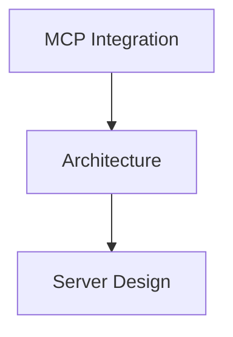

# Thought-to-Action System Directive

## Goal

Enable natural language interaction for creating reminders, managing TODO lists, and building mind maps through the MCP server. Transform conversational requests into actionable tasks stored persistently on disk.

## Inputs

- **Natural language requests** from user via MCP-enabled Claude conversation
- **Existing data** from `.tmp/user_data/`:
  - `todos.json` - Persistent TODO list
  - `mindmaps/{id}.json` - Individual mind map files
  - `mindmaps/index.json` - Mind map registry
- **System configuration** from `.env.diagnostic`:
  - `MCP_TODO_FILE` - Path to TODO storage
  - `MCP_MINDMAP_DIR` - Mind map storage directory
  - `MCP_REMINDER_LIST_NAME` - macOS Reminders list name
  - `MCP_LOG_FILE` - Server log location

## Tools/Scripts to Use

### Starting the MCP Server

**Primary Tool:**
```bash
./scripts/start_mcp_server.sh
```

This launcher script:
- Validates environment (`.env.diagnostic` exists)
- Checks Python dependencies (mcp, anthropic)
- Creates `.tmp/user_data/` directory structure
- Launches `execution/mcp_server.py`

**Manual Start (for debugging):**
```bash
cd /Users/sergevilleneuve/Documents/MyExperiments/HVAC_ideas
python3 execution/mcp_server.py
```

### Execution Layer Components

**MCP Server:**
- **File**: `execution/mcp_server.py`
- **Purpose**: Main server process, tool registration, request routing
- **Logging**: `.tmp/mcp_server.log`

**Tool Managers:**
- **`execution/mcp_tools/reminder_tools.py`** - ReminderManager class
  - Wraps `scripts/create_reminder.sh` for macOS Reminders
  - Platform detection (macOS vs. other OS)
  - Graceful fallback to JSON storage

- **`execution/mcp_tools/todo_tools.py`** - TodoManager class
  - CRUD operations on `todos.json`
  - Filtering, priority management, tagging
  - Dataclass pattern from `agent_coordinator.py`

- **`execution/mcp_tools/mindmap_tools.py`** - MindMapManager class
  - Tree structure management
  - Export to Markdown, JSON, Mermaid
  - Node traversal and search

- **`execution/mcp_tools/storage.py`** - Storage abstraction
  - Atomic file writes
  - File locking for concurrent access
  - Backup on corruption

## Workflow

### 1. Reminder Creation

**User Request Examples:**
- "Remind me to test backup drive in 2 hours"
- "Set a reminder for tomorrow at 3pm to review logs"
- "Create a reminder: Check oil tank levels"

**AI Orchestration Steps:**
1. Parse natural language to extract:
   - `title` (required) - e.g., "test backup drive"
   - `notes` (optional) - additional details
   - `hours_from_now` (default: 4) - timing
2. Call MCP tool: `create_reminder`
3. Receive confirmation with scheduled time
4. Present formatted response to user

**Expected Output Format:**
```
✅ Reminder 'test backup drive' set for 2 hours from now
Scheduled: 2026-01-15 16:30:00
```

**macOS Integration:**
- Reminder created in "Claude Reminders" list
- List auto-created if doesn't exist
- Due date set to calculated future time
- Notes field populated with details

**Non-macOS Fallback:**
- Reminder stored in `.tmp/user_data/reminders.json`
- Warning message: "Reminder stored (OS integration not available on {platform})"
- Can still be listed/cancelled via MCP tools

### 2. TODO Management

**User Request Examples:**
- "Add to my TODO: Review HVAC documentation"
- "Add TODO: Fix oil tank sensor, high priority, tag it as maintenance"
- "Show me all pending TODOs"
- "Mark TODO todo_20260115_143000_abc123 as completed"

**AI Orchestration Steps:**

#### Adding a TODO:
1. Parse request to extract:
   - `title` (required) - "Review HVAC documentation"
   - `description` (optional) - detailed notes
   - `priority` (default: medium) - low, medium, high
   - `tags` (optional) - ["documentation", "review"]
   - `due_date` (optional) - ISO format or natural language
2. Call MCP tool: `add_todo`
3. Receive TODO with generated ID
4. Confirm to user with details

**Expected Output Format:**
```
✅ TODO created: Review HVAC documentation

**Details:**
- ID: `todo_20260115_143000_abc123`
- Priority: medium
- Status: pending
- Tags: documentation, review
```

#### Listing TODOs:
1. Determine filters from request:
   - `status` - pending, in_progress, completed, cancelled
   - `tags` - filter by tag list
   - `priority` - low, medium, high
2. Call MCP tool: `list_todos`
3. Format results with status icons
4. Show count and applied filters

**Expected Output Format:**
```
**5 TODOs:**

⏸️ **Review HVAC documentation** (`todo_20260115_143000_abc123`)
  Priority: medium | Status: pending
  Check all technical guides...

🔄 **Fix oil tank sensor** (`todo_20260115_150000_def456`)
  Priority: high | Status: in_progress
  Replace faulty sensor in Tank 2...
```

#### Updating/Completing TODOs:
1. Identify TODO by ID or fuzzy title match
2. Determine update fields from request
3. Call appropriate tool: `update_todo` or `complete_todo`
4. Confirm changes

**Status Icons:**
- ⏸️ pending
- 🔄 in_progress
- ✅ completed
- ❌ cancelled

### 3. Mind Map Creation and Management

**User Request Examples:**
- "Create a mind map for the MCP integration project"
- "Add a node to mind map mindmap_20260115_143500_xyz789: Architecture"
- "Show me my mind map about HVAC diagnostics"
- "Export the MCP mind map to Markdown"

**AI Orchestration Steps:**

#### Creating a Mind Map:
1. Parse request to extract:
   - `title` (required) - "MCP Integration Project"
   - `root_topic` (required) - central concept
   - `initial_nodes` (optional) - initial branches
2. Call MCP tool: `create_mindmap`
3. Receive mind map with root node
4. Confirm with node count

**Expected Output Format:**
```
✅ Mind map created!

**Mind Map Created:**
- ID: `mindmap_20260115_143500_xyz789`
- Title: MCP Integration Project
- Root: MCP Integration
- Nodes: 1

Ready to add branches. Try: 'Add node to mind map: Architecture'
```

#### Adding Nodes:
1. Parse request to extract:
   - `mindmap_id` (required) - target mind map
   - `parent_node_id` (required) - where to attach (default: root)
   - `text` (required) - node content
   - `metadata` (optional) - color, icon, etc.
2. Call MCP tool: `add_mindmap_node`
3. Confirm node added with ID

#### Exporting Mind Maps:
1. Determine export format: markdown, json, mermaid
2. Call MCP tool: `export_mindmap`
3. Return formatted content in code block

**Markdown Export Example:**
```markdown
# MCP Integration Project

*Created: 2026-01-15T14:35:00Z*
*Updated: 2026-01-15T14:35:00Z*

## MCP Integration
  - Architecture
    - Server Design
    - Tool Modules
  - Implementation
    - Storage Layer
    - API Integration
```

**Mermaid Export Example:**


## Outputs

### Data Storage Locations

**Reminders:**
- **macOS**: Native Reminders app → "Claude Reminders" list
- **Other OS**: `.tmp/user_data/reminders.json`

**TODOs:**
- **File**: `.tmp/user_data/todos.json`
- **Format**:
  ```json
  {
    "version": "1.0",
    "last_updated": "ISO timestamp",
    "todos": [
      {
        "id": "todo_YYYYMMDD_HHMMSS_uuid",
        "title": "...",
        "description": "...",
        "priority": "low|medium|high",
        "status": "pending|in_progress|completed|cancelled",
        "tags": ["tag1", "tag2"],
        "created_at": "ISO timestamp",
        "updated_at": "ISO timestamp",
        "due_date": "ISO timestamp or null",
        "completed_at": "ISO timestamp or null"
      }
    ]
  }
  ```

**Mind Maps:**
- **Directory**: `.tmp/user_data/mindmaps/`
- **Individual files**: `{mindmap_id}.json`
- **Index**: `mindmaps/index.json`
- **Format**:
  ```json
  {
    "id": "mindmap_YYYYMMDD_HHMMSS_uuid",
    "title": "...",
    "created_at": "ISO timestamp",
    "updated_at": "ISO timestamp",
    "root": {
      "id": "node_root",
      "text": "...",
      "children": [...],
      "metadata": {}
    }
  }
  ```

**Logs:**
- **File**: `.tmp/mcp_server.log`
- **Format**: `[timestamp] [level] [logger] message`
- **Rotation**: None (append-only)

## Edge Cases & Constraints

### Reminders on Non-macOS Platforms

**Scenario:** User on Windows/Linux requests reminder

**Behavior:**
1. ReminderManager detects platform via `platform.system()`
2. Falls back to GenericReminderBackend
3. Stores reminder in `.tmp/user_data/reminders.json`
4. Returns success with warning message

**Message:**
```
✅ Reminder stored (OS integration not available on Linux)
Scheduled: 2026-01-15 16:30:00
```

**User Action:** Can still list/cancel via `list_reminders` and `cancel_reminder` tools

### Duplicate TODO Detection

**Scenario:** User creates TODO with same title as existing one

**Behavior:**
1. System allows duplicate (different IDs)
2. Warning logged but not blocking
3. Both TODOs appear in `list_todos`

**Recommendation:** Search before creating to avoid duplicates
```
"Before adding 'Review documentation', show me existing TODOs with 'documentation'"
```

### Deep Mind Map Nesting

**Scenario:** Mind map exceeds 10 levels of depth

**Behavior:**
1. Operation succeeds
2. Warning logged: "Mind map depth exceeds 10 levels"
3. Suggest reorganization or semantic clustering

**Recommendation:**
```
"The mind map is getting deep. Consider organizing it semantically or flattening the structure."
```

### Corrupted JSON Files

**Scenario:** `todos.json` or mind map file corrupted

**Behavior:**
1. JSONStorage detects corruption during read
2. Creates backup: `{file}.corrupted.YYYYMMDD_HHMMSS`
3. Initializes fresh storage
4. Logs error with details
5. Returns empty list to user

**Error Message:**
```
⚠️ Storage file corrupted. Backup created at .tmp/user_data/todos.json.corrupted.20260115_143000
Initialized fresh storage. Previous data backed up.
```

**Recovery:** User can restore from backup manually

### Concurrent Access

**Scenario:** Multiple MCP tool calls access same file simultaneously

**Behavior:**
1. File locking mechanism activates
2. Second request waits with exponential backoff
3. Timeout after 5 seconds
4. Returns error if still locked

**Error Message:**
```
❌ Could not acquire lock for .tmp/user_data/todos.json
Storage may be in use by another process. Try again in a moment.
```

### Missing .env.diagnostic

**Scenario:** MCP server started without configuration file

**Behavior:**
1. Script detects missing `.env.diagnostic`
2. Prints error with template
3. Exits with code 1

**Error Template:**
```
❌ Error: .env.diagnostic not found

Please create .env.diagnostic with:
  ANTHROPIC_API_KEY=your-api-key
  MCP_TODO_FILE=.tmp/user_data/todos.json
  MCP_MINDMAP_DIR=.tmp/user_data/mindmaps
  MCP_REMINDER_LIST_NAME=Claude Reminders
  MCP_LOG_FILE=.tmp/mcp_server.log
```

### Title/Description Length Validation

**Scenario:** User provides excessively long text

**Constraints:**
- TODO title: 200 characters max
- TODO description: 2000 characters max
- Mind map node text: No hard limit, but warn if >500 chars

**Behavior:**
1. Validation occurs in manager layer
2. Returns error if exceeded
3. User must shorten input

**Error Message:**
```
❌ Title too long (max 200 characters)
Current: 245 characters
```

## Success Criteria

### Reminder Creation
- ✅ Reminder appears in macOS Reminders app (or JSON on other platforms)
- ✅ "Claude Reminders" list created automatically if needed
- ✅ Due date calculated correctly based on hours_from_now
- ✅ Notes field populated with provided text
- ✅ Confirmation message returned to user

### TODO Operations
- ✅ TODO persists in `todos.json` with all fields
- ✅ Generated ID is unique and timestamped
- ✅ Priority validation enforces low/medium/high
- ✅ Status transitions work (pending → in_progress → completed)
- ✅ completed_at timestamp set when status becomes "completed"
- ✅ Filtering by status, tags, priority works correctly
- ✅ Search finds TODOs by title/description substring

### Mind Map Operations
- ✅ Mind map persists in `mindmaps/{id}.json`
- ✅ Index updated with new entries
- ✅ Tree structure maintained correctly (parent-child relationships)
- ✅ Nodes can be added at any depth
- ✅ Export to Markdown produces valid syntax
- ✅ Export to Mermaid produces valid diagram code
- ✅ Node count accurate across entire tree

### Data Integrity
- ✅ Atomic writes prevent corruption
- ✅ File locks prevent concurrent write conflicts
- ✅ Corrupted files backed up before reset
- ✅ All timestamps in ISO 8601 format
- ✅ Version field present in all storage files

### Error Handling
- ✅ Clear error messages for validation failures
- ✅ Platform-specific warnings for unsupported features
- ✅ Graceful degradation when OS integration unavailable
- ✅ Detailed logging for debugging
- ✅ Non-blocking errors don't crash server

## Timing Expectations

**Operation Performance Targets:**

| Operation | Target Time | Notes |
|-----------|------------|-------|
| Reminder creation | <2 seconds | Includes AppleScript execution |
| TODO add/update | <500ms | JSON read/write with locking |
| TODO list (no filters) | <200ms | Read-only operation |
| TODO list (with filters) | <500ms | In-memory filtering |
| Mind map creation | <1 second | JSON write + index update |
| Mind map node addition | <800ms | Tree traversal + write |
| Mind map export (Markdown) | <1 second | Tree traversal + formatting |
| Mind map export (Mermaid) | <1.5 seconds | More complex formatting |
| Server startup | <3 seconds | Manager initialization |

**Factors Affecting Performance:**
- **File size**: Larger TODOs/mind maps take longer to read/write
- **Mind map depth**: Deep trees increase traversal time
- **Concurrent access**: File locking adds wait time
- **Platform**: macOS AppleScript may vary in speed

## Known Limitations

### MVP Constraints

1. **Reminders require macOS** (graceful fallback on other OS)
   - AppleScript only available on macOS
   - Windows/Linux users get JSON storage only
   - No notification system on non-macOS

2. **No recurring TODOs**
   - Single-instance TODOs only
   - User must manually recreate recurring tasks
   - Future enhancement possible

3. **Mind map visualization requires export**
   - No built-in graphical viewer
   - Must export to external tool (Mermaid, GraphViz)
   - Markdown export is text-only

4. **No real-time sync across sessions**
   - Each MCP server instance is independent
   - Changes not visible to other Claude conversations
   - User must restart server to see external file changes

5. **Semantic clustering requires Gemini API** (Phase 2)
   - Not implemented in MVP
   - Would need API key and internet connection
   - Cost per clustering operation

6. **No backup/restore UI**
   - Manual file management required
   - User must copy `.tmp/user_data/` manually
   - Future `export_user_data` tool planned

## Self-Annealing Improvements

When issues arise during operation:

1. **Log detailed error context** in `.tmp/mcp_server.log`
2. **Update this directive** with new edge case
3. **Enhance tool validation** if bad input detected
4. **Add to test suite** (when tests are created)
5. **Document in troubleshooting section** below

### Troubleshooting Common Issues

**Problem: "MCP SDK not installed"**
```bash
# Solution
pip install mcp>=1.25.0 anthropic>=0.40.0
# Or
pip install -r requirements.txt
```

**Problem: "TODO not found for update"**
```bash
# Check TODO exists first
list_todos  # Get correct ID
# Then update with exact ID
update_todo todo_id=todo_20260115_143000_abc123 status=completed
```

**Problem: "Parent node not found" in mind map**
```bash
# Get mind map structure first
get_mindmap mindmap_id=mindmap_20260115_143500_xyz789
# Use node_root for top-level nodes
add_mindmap_node mindmap_id=... parent_node_id=node_root text="New Branch"
```

**Problem: Reminders not appearing on macOS**
```bash
# Check Reminders app is running
open -a Reminders

# Verify list exists
list_reminders

# Check script permissions
ls -la scripts/create_reminder.sh  # Should be executable
```

**Problem: "Could not acquire lock"**
```bash
# Wait a moment and retry
# Or check if another process is using the file
lsof .tmp/user_data/todos.json

# If stuck, remove lock file (USE WITH CAUTION)
rm .tmp/user_data/todos.json.lock
```

## Related Documentation

- **[README.md - MCP Section](../README.md#3-mcp-thought-to-action-system-)** - Quick start guide
- **[scripts/README.md](../scripts/README.md)** - Launcher script documentation
- **[MCP Implementation Plan](~/.claude/plans/dazzling-petting-planet.md)** - Detailed architecture
- **[agent_coordinator.py](../execution/agent_coordinator.py)** - Dataclass pattern reference
- **[CLAUDE.md](../CLAUDE.md)** - 3-layer architecture overview

## Version History

- **v1.0** (2026-01-15) - Initial implementation
  - 12 MCP tools (3 reminder + 5 TODO + 4 mind map)
  - JSON storage with atomic writes and file locking
  - macOS Reminders integration with cross-platform fallback
  - Markdown and Mermaid export for mind maps
