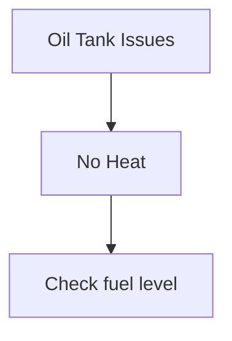

# Claude Code Skills Implementation Plan (Revised)

## Executive Summary

This plan implements **Claude Code skills** for all active projects following official best practices. Each skill uses the `SKILL.md` format with YAML frontmatter, located in `.claude/skills/` directories for team sharing.

**Key Changes from Original Plan:**

- ✅ Use `.claude/skills/` instead of `skills/`
- ✅ SKILL.md format only (no JSON definitions)
- ✅ Natural language instructions instead of parameter schemas
- ✅ Proper skill activation descriptions with trigger keywords

---

## Official Best Practices Framework

### 1. Directory Structure

**Project Skills** (shared with team in repository):

```
project/
├── .claude/
│   └── skills/
│       ├── skill-name/
│       │   ├── SKILL.md           # Required: Skill definition
│       │   ├── scripts/           # Optional: Helper scripts
│       │   ├── references/        # Optional: Detailed docs
│       │   └── assets/            # Optional: Templates
│       └── _shared/               # Shared utilities
└── [project files]
```

### 2. SKILL.md Format

```yaml
---
name: skill-name
description: What it does and when to use it. Include trigger keywords users would say.
allowed-tools: Bash, Read, Edit  # Optional: Restrict permissions
model: claude-sonnet-4           # Optional: Specific model
---

# Skill Title

Instructions for Claude in Markdown format.
No parameter schemas - use natural language.
```

### 3. Description Field Best Practices

**Good description structure:**

- **What it does**: List specific capabilities
- **When to use**: Include trigger keywords and phrases
- **Be specific**: Unique triggers for each skill

**Example:**

```yaml
description: Run HVAC diagnostic sessions for Tank 1 or Tank 2 with automatic session archival. Use when the user wants to diagnose HVAC issues, troubleshoot heating problems, mentions "tank diagnostic", or needs AI-powered analysis.
```

### 4. Skills Use Natural Language

Skills don't have formal parameters. Instead:

- Users request in natural language
- Claude extracts intent from conversation
- Instructions guide Claude on what to ask

---

## Phase 1: HVAC_ideas Skills (Priority: High)

**Location**: `/Users/sergevilleneuve/Documents/MyExperiments/HVAC_ideas`

### Skill 1: hvac-diagnostic

**Directory**: `.claude/skills/hvac-diagnostic/`

**SKILL.md Structure**:

```yaml
---
name: hvac-diagnostic
description: Run interactive HVAC diagnostic sessions for Tank 1 or Tank 2 with automatic session archival and AI-powered analysis. Use when the user wants to diagnose HVAC issues, troubleshoot heating problems, mentions "tank diagnostic", "tank 1", "tank 2", or needs help with HVAC system troubleshooting.
allowed-tools: Bash, Read, Write
---

# HVAC Diagnostic Runner

Run HVAC diagnostic sessions with automatic logging and optional AI analysis.

## When This Skill Applies

- User wants to diagnose HVAC issues
- User mentions "tank diagnostic" or "HVAC troubleshooting"
- User needs AI-powered or basic diagnostic questionnaire
- User references Tank 1 or Tank 2

## How to Use

Ask me to:
- "Run a diagnostic on Tank 1"
- "Diagnose Tank 2 with AI mode"
- "Start basic diagnostic for heating issues"

I'll guide you through the diagnostic process.

## Implementation

### Available Modes

**AI Mode** (requires API key):
- Interactive Q&A with GPT-4
- Intelligent follow-up questions
- Automated report generation

**Basic Mode** (no API key needed):
- Structured questionnaire
- Manual symptom logging
- Text-based output

### Workflow

1. Validate `.env.diagnostic` exists and contains required keys
2. Ask user which tank (1 or 2) and mode (AI or basic)
3. Execute appropriate diagnostic script
4. Archive output to `.tmp/Tank{N}_Diagnostic_Session_{timestamp}.txt`
5. Offer to generate PDF report

### Scripts

- `scripts/diagnostic-runner.sh` - Main orchestration script
- Uses existing `scripts/run_ai_diagnostic.sh` and `scripts/run_tank1_diagnostic.sh`

## Supporting Files

See `references/diagnostic-outputs.md` for sample session formats.
```

**Files to Create**:

- `.claude/skills/hvac-diagnostic/SKILL.md`
- `.claude/skills/hvac-diagnostic/scripts/diagnostic-runner.sh`
- `.claude/skills/hvac-diagnostic/references/diagnostic-outputs.md`

---

### Skill 2: hvac-mcp

**Directory**: `.claude/skills/hvac-mcp/`

**SKILL.md Structure**:

```yaml
---
name: hvac-mcp
description: Manage HVAC MCP thought-to-action server lifecycle (start, stop, restart, status, logs). Use when the user wants to start the MCP server, check if MCP is running, view server logs, restart the server, or mentions "MCP" or "thought-to-action".
allowed-tools: Bash, Read
---

# HVAC MCP Server Manager

Manage the lifecycle of the HVAC MCP thought-to-action server for reminders, TODOs, and mind maps.

## When This Skill Applies

- User wants to start/stop/restart MCP server
- User asks about MCP server status or health
- User needs to view MCP server logs
- User mentions "MCP", "thought-to-action", or "reminder server"

## How to Use

Ask me to:
- "Start the MCP server"
- "Is the MCP server running?"
- "Show me MCP logs"
- "Restart the MCP server"
- "Stop the thought-to-action server"

I'll execute the appropriate server management command.

## Available Actions

### Start Server
Launches MCP server in background with health check:
```bash
./scripts/start_mcp_server.sh
```

### Check Status

Shows if server is running, uptime, and recent activity:

```bash
pgrep -f "mcp_server.py" && echo "✓ Running" || echo "✗ Stopped"
tail -5 .tmp/mcp_server.log
```

### View Logs

Tail server log (optionally follow in real-time):

```bash
tail -f .tmp/mcp_server.log
```

### Stop Server

Gracefully terminate server process:

```bash
pkill -f "mcp_server.py"
```

### Restart Server

Stop and start with confirmation:

```bash
pkill -f "mcp_server.py" && sleep 2 && ./scripts/start_mcp_server.sh
```

## Implementation

Use bundled `scripts/mcp-manager.sh` for all operations with proper error handling.

## Troubleshooting

If server won't start:

1. Check `.env.diagnostic` exists
2. Verify Python dependencies: `pip list | grep mcp`
3. Check for port conflicts on stdio transport
4. Review `.tmp/mcp_server.log` for errors

```

**Files to Create**:
- `.claude/skills/hvac-mcp/SKILL.md`
- `.claude/skills/hvac-mcp/scripts/mcp-manager.sh`

---

### Skill 3: hvac-todo

**Directory**: `.claude/skills/hvac-todo/`

**SKILL.md Structure**:
```yaml
---
name: hvac-todo
description: Batch TODO operations via MCP server (add, list, filter, complete, export). Use when the user wants to manage TODOs, view task lists, mark tasks complete, export TODO reports, or mentions "todo", "tasks", or "checklist".
allowed-tools: Bash, Read, Write
---

# HVAC TODO Manager

Batch operations on TODOs stored via MCP thought-to-action server.

## When This Skill Applies

- User wants to add, list, or complete TODOs
- User needs to export TODO lists
- User wants to filter TODOs by status/priority/tags
- User mentions "todo", "tasks", "checklist", or "to-do"

## How to Use

Ask me to:
- "Add a TODO to review HVAC documentation"
- "Show me all pending TODOs"
- "List high-priority TODOs tagged 'maintenance'"
- "Mark TODO todo_xyz as completed"
- "Export my TODOs to Markdown"

I'll execute the appropriate TODO operation.

## Available Operations

### Add TODO
Create new task with optional priority, tags, and due date:
- I'll ask for title (required)
- Description (optional)
- Priority: low, medium, high (default: medium)
- Tags (optional)
- Due date (optional)

### List TODOs
Filter by:
- Status: pending, in_progress, completed, cancelled
- Priority: low, medium, high
- Tags: maintenance, documentation, diagnostic, etc.
- Due date range

### Complete TODO
Mark task as done with completion timestamp.

### Update TODO
Change status, priority, tags, or due date.

### Delete TODO
Remove task (moves to cancelled status).

### Export TODOs
Generate Markdown report:
```markdown
# HVAC TODOs - 2026-01-16

## High Priority (2 tasks)
- [ ] Fix oil tank sensor
- [ ] Review diagnostic logs

## Medium Priority (3 tasks)
...
```

## Implementation

1. Verify MCP server is running (uses `hvac-mcp` skill)
2. Execute appropriate MCP tool via Python wrapper
3. Format results with status icons:
   - ⏸️ pending
   - 🔄 in_progress
   - ✅ completed
   - ❌ cancelled

## Data Location

TODOs stored in `.tmp/user_data/todos.json` (managed by MCP server).

```

**Files to Create**:
- `.claude/skills/hvac-todo/SKILL.md`
- `.claude/skills/hvac-todo/scripts/todo-batch.py`

---

### Skill 4: hvac-reminder

**Directory**: `.claude/skills/hvac-reminder/`

**SKILL.md Structure**:
```yaml
---
name: hvac-reminder
description: Create macOS reminders for HVAC maintenance tasks with presets for common tasks (filter check, drain tank, oil delivery). Use when the user wants to set reminders, schedule maintenance, mentions "remind me", "maintenance reminder", or specific HVAC tasks.
allowed-tools: Bash
---

# HVAC Maintenance Reminder Creator

Create macOS Reminders for HVAC maintenance tasks with smart presets.

## When This Skill Applies

- User wants to set maintenance reminders
- User mentions "remind me", "set reminder", or "schedule maintenance"
- User references specific HVAC tasks (filter, tank, oil delivery)

## How to Use

Ask me to:
- "Set a filter check reminder"
- "Remind me to drain the tank in 2 weeks"
- "Create custom HVAC reminder"

I'll create the reminder in macOS Reminders app.

## Available Presets

### Filter Check
- **Title**: "Check HVAC filter"
- **Notes**: "Inspect and replace if dirty"
- **Due**: 3 months from now
- **List**: Claude Reminders

### Drain Tank
- **Title**: "Drain HVAC condensate tank"
- **Notes**: "Check for sediment buildup"
- **Due**: 6 months from now
- **List**: Claude Reminders

### Oil Delivery
- **Title**: "Schedule oil tank refill"
- **Notes**: "Check tank level, call supplier"
- **Due**: User specified
- **List**: Claude Reminders

### Custom
Interactive prompt for:
- Title
- Notes
- Hours from now (or specific date)

## Implementation

Uses MCP `create_reminder` tool via `scripts/create_reminder.sh`.

**macOS Only**: Reminders integrate with Apple Reminders app.
**Other OS**: Falls back to JSON storage (`.tmp/user_data/reminders.json`).

## Workflow

1. Ask user which preset or custom
2. For custom, prompt for details
3. Call MCP reminder creation
4. Confirm reminder scheduled with timestamp
```

**Files to Create**:

- `.claude/skills/hvac-reminder/SKILL.md`
- `.claude/skills/hvac-reminder/scripts/reminder-presets.py`

---

### Skill 5: hvac-agent

**Directory**: `.claude/skills/hvac-agent/`

**SKILL.md Structure**:

```yaml
---
name: hvac-agent
description: Run multi-agent orchestration workflows for log analysis and Reddit HVAC summary generation. Use when the user wants to analyze system logs, get HVAC community insights, run agent-based troubleshooting, or mentions "multi-agent", "log analysis", or "Reddit summary".
allowed-tools: Bash, Read, Write
---

# HVAC Multi-Agent Workflow Runner

Execute complex multi-agent workflows for log analysis and community intelligence gathering.

## When This Skill Applies

- User wants to analyze macOS system logs for HVAC issues
- User needs Reddit HVAC community summary
- User mentions "multi-agent", "agent workflow", or "orchestration"
- User asks about log troubleshooting or community insights

## How to Use

Ask me to:
- "Analyze system logs for HVAC errors"
- "Generate Reddit HVAC summary"
- "Run log analysis workflow"
- "Get community insights on heating issues"

I'll execute the appropriate multi-agent workflow.

## Available Workflows

### Log Analysis
**Purpose**: Parse macOS logs for HVAC-related errors

**Process**:
1. **Collector Agent**: Fetch recent system logs
2. **Filter Agent**: Extract HVAC/heating related entries
3. **Analyzer Agent**: Identify patterns and anomalies
4. **Reporter Agent**: Generate diagnostic summary

**Script**: `scripts/resolve_system_issues.sh`

**Output**: `.tmp/phase1_diagnostic.txt`, `.tmp/phase2_debate.txt`

### Reddit Summary
**Purpose**: Daily digest of r/HVAC top posts

**Process**:
1. **Scraper Agent**: Fetch posts from Reddit API
2. **Cleaner Agent**: Remove spam, filter quality posts
3. **Clusterer Agent**: Group by topic (Gemini API)
4. **Evaluator Agent**: Rank by relevance and quality
5. **Summarizer Agent**: Generate executive summary

**Script**: Composite of multiple execution scripts

**Output**: Google Slides presentation or Markdown report

### Custom Workflow
Interactive agent coordinator setup for ad-hoc workflows.

## Implementation

Follows 3-layer architecture:
- **Layer 1 (Directives)**: `directives/resolve_macos_logs.md`, `directives/reddit_daily_summary.md`
- **Layer 2 (Orchestration)**: This skill (decision-making)
- **Layer 3 (Execution)**: Python scripts in `execution/`

## Configuration

Requires `.env.diagnostic` with:
- `ANTHROPIC_API_KEY` (for agent coordination)
- `GEMINI_API_KEY` (for semantic clustering)
- `REDDIT_API_KEY` (for Reddit summary)

## Workflow Selection

I'll determine which workflow based on your request:
- Keywords "log", "error", "system" → Log Analysis
- Keywords "reddit", "community", "summary" → Reddit Summary
- User explicitly asks → Custom setup
```

**Files to Create**:

- `.claude/skills/hvac-agent/SKILL.md`
- `.claude/skills/hvac-agent/scripts/agent-runner.sh`

---

### Skill 6: hvac-setup

**Directory**: `.claude/skills/hvac-setup/`

**SKILL.md Structure**:

```yaml
---
name: hvac-setup
description: Validate and setup HVAC development environment (Python, dependencies, API keys, directory structure). Use when starting HVAC project, troubleshooting environment issues, mentions "setup", "environment", "dependencies", or "getting started".
allowed-tools: Bash, Read, Write, Edit
---

# HVAC Environment Setup & Validation

Comprehensive environment setup and validation for HVAC project.

## When This Skill Applies

- User is setting up HVAC project for first time
- User has environment/dependency issues
- User mentions "setup", "install", "environment", or "getting started"
- User asks "why isn't X working?"

## How to Use

Ask me to:
- "Set up HVAC environment"
- "Check if my environment is ready"
- "Validate HVAC dependencies"
- "Fix my HVAC setup"

I can run validation-only or full setup.

## Setup Process

### Check-Only Mode
Validates without making changes:
1. Python version (3.8+)
2. Virtual environment status
3. Installed packages vs requirements.txt
4. .env.diagnostic configuration
5. API key validity (non-destructive ping)
6. Directory structure (.tmp/, user_data/)

**Output**: Environment report with pass/fail for each check

### Full Setup Mode
Automated installation:
1. Check Python 3.8+
2. Create virtual environment if missing
3. Install requirements.txt packages
4. Create .env.diagnostic from .env.example
5. Prompt for API keys (interactive)
6. Test API connections
7. Create .tmp/user_data/ structure
8. Run validation checks

## Implementation

Uses shared utilities from `.claude/skills/_shared/`:
- `validators.sh` - Check functions
- `formatters.sh` - Colored output
- `config-loader.sh` - Environment management

### Validation Checks

```bash
✓ Python 3.11.0 installed
✓ Virtual environment: venv/
✓ Dependencies installed (12/12)
✓ .env.diagnostic exists
✓ ANTHROPIC_API_KEY valid
✗ GEMINI_API_KEY not set
✓ Directory structure ready
```

## Interactive Mode

For full setup, I'll ask:

1. "Create virtual environment?" (if missing)
2. "Install dependencies now?" (if outdated)
3. "Enter API keys interactively?" (if missing)
4. "Test API connections?" (after configuration)

## Troubleshooting

Common issues:

- **Python version**: Upgrade to 3.8+ or use pyenv
- **venv not activated**: `source venv/bin/activate`
- **API key invalid**: Check key format and permissions
- **Port conflicts**: Check if MCP server already running

```

**Files to Create**:
- `.claude/skills/hvac-setup/SKILL.md`
- `.claude/skills/hvac-setup/scripts/setup-validator.py`

---

### Skill 7: hvac-mindmap

**Directory**: `.claude/skills/hvac-mindmap/`

**SKILL.md Structure**:
```yaml
---
name: hvac-mindmap
description: Create and manage mind maps for HVAC troubleshooting with Markdown, JSON, and Mermaid export formats. Use when the user wants to create mind maps, organize troubleshooting knowledge, visualize HVAC concepts, or mentions "mind map", "diagram", or "knowledge tree".
allowed-tools: Bash, Read, Write
---

# HVAC Mind Map Manager

Create and manage hierarchical mind maps for HVAC troubleshooting knowledge.

## When This Skill Applies

- User wants to create troubleshooting mind maps
- User needs to organize HVAC knowledge
- User wants to visualize diagnostic workflows
- User mentions "mind map", "knowledge tree", "diagram", or "visualization"

## How to Use

Ask me to:
- "Create a mind map for oil tank troubleshooting"
- "Show my HVAC mind maps"
- "Export mind map to Mermaid diagram"
- "Add node to troubleshooting mind map"

I'll manage mind maps via MCP server.

## Available Operations

### Create Mind Map
I'll ask for:
- **Title**: "Oil Tank Troubleshooting"
- **Root topic**: Central concept (e.g., "Oil Tank Issues")
- **Initial nodes** (optional): Starting branches

**Output**: Mind map ID for future reference

### List Mind Maps
Shows all mind maps with:
- Title
- ID
- Node count
- Last updated timestamp

### Add Nodes
Add branches to existing mind map:
- Parent node (defaults to root)
- Node text
- Optional metadata (color, icon, priority)

### Export Mind Map

**Markdown Format**:
```markdown
# Oil Tank Troubleshooting

## Oil Tank Issues
  - No Heat
    - Check fuel level
    - Inspect igniter
  - Leaking
    - Visual inspection
    - Call professional
```

**JSON Format**: Full tree structure with metadata

**Mermaid Format**: Renderable diagram



### Visualize Mind Map

Convert to Mermaid and render (if Mermaid CLI installed).

## Implementation

Uses MCP mindmap tools:

- `create_mindmap`
- `list_mindmaps`
- `add_mindmap_node`
- `export_mindmap`

**Storage**: `.tmp/user_data/mindmaps/{id}.json`

## Workflow

1. Verify MCP server running
2. Execute appropriate mindmap operation
3. For exports, format and save to file
4. For Mermaid, optionally render to PNG/SVG

## Tips

- Keep node text concise (< 50 chars)
- Use metadata for color-coding by priority
- Export to Mermaid for presentations
- Export to Markdown for documentation

```

**Files to Create**:
- `.claude/skills/hvac-mindmap/SKILL.md`
- `.claude/skills/hvac-mindmap/scripts/mindmap-manager.py`

---

### Skill 8: hvac-report

**Directory**: `.claude/skills/hvac-report/`

**SKILL.md Structure**:
```yaml
---
name: hvac-report
description: Generate PDF diagnostic reports from session logs for Tank 1, Tank 2, or troubleshooting sessions. Use when the user wants a PDF report, professional diagnostic document, mentions "report", "PDF", or "documentation".
allowed-tools: Bash, Read, Write
---

# HVAC Diagnostic Report Generator

Generate professional PDF diagnostic reports from session logs.

## When This Skill Applies

- User wants PDF report of diagnostic session
- User needs professional documentation
- User mentions "report", "PDF", "document", or "generate report"
- After completing diagnostic session

## How to Use

Ask me to:
- "Generate PDF report for Tank 1 diagnostic"
- "Create report from latest session"
- "Make a PDF of troubleshooting session"

I'll generate professional PDF report.

## Report Types

### Tank 1 Diagnostic Report
- Session summary
- Symptoms logged
- AI analysis (if available)
- Recommended actions
- Component checklist

### Tank 2 Diagnostic Report
Similar to Tank 1 with tank-specific parameters.

### Troubleshooting Report
Generic format for any HVAC troubleshooting session.

## Implementation

### Input
Session log from `.tmp/diagnostics/Tank{N}_Diagnostic_Session_{timestamp}.txt`

### Process
1. Parse session log
2. Extract key data:
   - Symptoms
   - Measurements
   - AI recommendations
   - Actions taken
3. Generate formatted Markdown
4. Convert to PDF using pandoc or weasyprint

### Output
PDF saved to `reports/Tank{N}_Report_{timestamp}.pdf`

## Workflow

1. List available session logs
2. User selects session (or I use most recent)
3. Generate PDF
4. Open PDF automatically (macOS: `open`, Linux: `xdg-open`)
5. Confirm file location

## Requirements

**PDF Generation** (one of):
- pandoc + LaTeX
- weasyprint (Python package)
- Anthropic Agent Skills API (PDF skill)

I'll detect available tool and use appropriate generator.

## Template

Reports use branded template with:
- Header: "HVAC Diagnostic Report"
- Date and session ID
- Summary section
- Detailed findings
- Recommendations
- Footer: "Generated by HVAC AI Assistant"
```

**Files to Create**:

- `.claude/skills/hvac-report/SKILL.md`
- `.claude/skills/hvac-report/scripts/report-generator.sh`
- `.claude/skills/hvac-report/assets/report-template.md`

---

## Shared Utilities

**Location**: `.claude/skills/_shared/scripts/`

These utilities are already created and ready to use:

✅ **config-loader.sh** (326 lines)

- `load_env_file()` - Load .env files
- `validate_env_vars()` - Check required variables
- `get_config()` / `set_config()` - Configuration management
- `check_config_conflicts()` - Validate against .env.example

✅ **formatters.sh** (288 lines)

- `print_success()`, `print_error()`, `print_warning()`, `print_info()`
- `print_progress()` - Progress bars
- `print_table_header()` / `print_table_row()` - Tabular output
- `print_status()` - Status badges

✅ **validators.sh** (218 lines)

- `check_node_installed()`, `check_python_installed()`
- `check_env_file()`, `check_env_var()`
- `check_port_available()`, `check_directory_exists()`
- `validate_api_key()` - API key format validation

All skills should source these utilities for consistent output and validation.

---

## Phase 2: React/Vite Projects (Priority: High)

### Project: weatherAppDemo

**Location**: `/Users/sergevilleneuve/Documents/MyExperiments/weatherAppDemo`

#### Skill 1: weather-dev

**Directory**: `.claude/skills/weather-dev/`

**SKILL.md** (abbreviated):

```yaml
---
name: weather-dev
description: Start weatherAppDemo development server with environment validation and optional demo mode. Use when the user wants to run the weather app, start dev server, test the app, or mentions "weather dev", "start weather", or "demo mode".
allowed-tools: Bash, Read
---

# Weather App Development Server

Start Vite development server with environment validation.

## How to Use

Ask me to:
- "Start weather app"
- "Run weather dev server"
- "Start weather app in demo mode"

## Modes

**Production Mode** (default):
- Requires `VITE_WEATHER_API_KEY` in `.env.local`
- Uses OpenWeatherMap API
- Real weather data

**Demo Mode**:
- No API key needed
- Mock weather data
- For testing UI without API costs

## Workflow

1. Check for `.env.local`, create from example if missing
2. Validate API key (unless demo mode)
3. Run `npm install` if node_modules missing
4. Execute `npm run dev`
5. Show server URL and mode
```

**Files to Create**:

- `.claude/skills/weather-dev/SKILL.md`
- `.claude/skills/weather-dev/scripts/dev-server.sh`

---

#### Skill 2: weather-build

**Directory**: `.claude/skills/weather-build/`

```yaml
---
name: weather-build
description: Build weatherAppDemo for production with bundle size analysis and optimization checks. Use when the user wants to build for production, deploy the app, analyze bundle size, or mentions "build", "production", or "deploy".
allowed-tools: Bash, Read
---

# Weather App Production Build

Create optimized production build with analysis.
```

---

#### Skill 3: weather-test-api

**Directory**: `.claude/skills/weather-test-api/`

```yaml
---
name: weather-test-api
description: Test OpenWeatherMap and Unsplash API integrations with response validation. Use when the user wants to test APIs, debug API issues, check API keys, or mentions "test API", "API connection", or "API not working".
allowed-tools: Bash
---

# Weather API Integration Tester

Test OpenWeatherMap and Unsplash API connections and responses.
```

---

#### Skill 4: weather-preview

```yaml
---
name: weather-preview
description: Preview production build locally before deployment. Use when the user wants to test production build, preview before deploy, or mentions "preview build" or "test production".
allowed-tools: Bash
---
```

---

#### Skill 5: weather-history

```yaml
---
name: weather-history
description: Manage weather search history stored in localStorage (export, clear, analyze). Use when the user wants to view search history, clear data, export history, or mentions "history" or "past searches".
allowed-tools: Bash, Read, Write
---
```

---

#### Skill 6: weather-setup

```yaml
---
name: weather-setup
description: Complete weather app setup with dependency installation, environment configuration, and API key setup. Use when setting up weather app first time, troubleshooting setup issues, or mentions "setup weather", "install", or "getting started".
allowed-tools: Bash, Read, Write, Edit
---
```

---

### Project: carparts (Next.js)

**Location**: `/Users/sergevilleneuve/Documents/MyExperiments/carparts`

#### Skills Summary

1. **carparts-dev** - Start Next.js dev server with port configuration
2. **carparts-lint** - Run ESLint with auto-fix option
3. **carparts-docker** - Manage Docker development environment
4. **carparts-build** - Build for production with size reporting
5. **carparts-start** - Start production server
6. **carparts-setup** - Environment setup and validation

(Full SKILL.md files follow same pattern as above)

---

## Phase 3: Three.js Game (Priority: High)

### Project: simcity-threejs-clone

**Location**: `/Users/sergevilleneuve/Documents/MyExperiments/simcity-threejs-clone`

#### Skills Summary

1. **simcity-dev** - Start game dev server with debug mode
2. **simcity-build** - Build with optional GitHub Pages deployment
3. **simcity-perf** - Analyze Three.js performance metrics
4. **simcity-docs** - Generate documentation from code
5. **simcity-test** - Run simulation logic tests
6. **simcity-context** - Generate optimized AI context for development tasks
7. **simcity-assets** - Validate and optimize 3D assets

---

## Phase 4: Utilities & Legacy Projects (Priority: Medium-Low)

### Project: mkproject

#### Skills Summary

1. **mkproject-test** - Test all project templates
2. **mkproject-enhance** - Suggest and implement template improvements
3. **mkproject-validate** - Validate shell integration
4. **mkproject-doc** - Generate template documentation

### Project: startrek-gallery

#### Skills Summary

1. **startrek-gallery-dev** - Start dev server
2. **startrek-gallery-test** - Run tests with coverage
3. **startrek-gallery-build** - Production build
4. **startrek-gallery-upgrade** - Update dependencies
5. **startrek-gallery-setup** - Environment setup

### Project: startrek-website

#### Skills Summary

1. **startrek-website-dev** - Start dev server
2. **startrek-website-test** - Run tests
3. **startrek-website-build** - Production build
4. **startrek-website-upgrade** - Update react-scripts 3.0.1 → 5.x
5. **startrek-website-setup** - Dependency validation

### Project: opencode

#### Skills Summary

1. **opencode-build** - Build Go binary
2. **opencode-test** - Run Go tests
3. **opencode-migrate** - Guide migration to Crush

---

## Implementation Strategy

### Skill Activation Flow

1. **At startup**: Claude loads skill names and descriptions (fast)
2. **On user request**: Claude matches request to skill descriptions
3. **If matched**: Claude asks permission before activating skill
4. **When active**: Claude executes SKILL.md instructions
5. **Progressive disclosure**: Supporting files loaded only when needed

### Directory Structure Per Project

```
project/
├── .claude/
│   └── skills/
│       ├── skill-1/
│       │   ├── SKILL.md           # Required
│       │   ├── scripts/           # Optional
│       │   ├── references/        # Optional
│       │   └── assets/            # Optional
│       ├── skill-2/
│       │   └── SKILL.md
│       └── _shared/               # Shared utilities
│           └── scripts/
│               ├── validators.sh
│               └── formatters.sh
└── [project files]
```

### Shared Utilities Strategy

Copy `_shared/` directory to each project for:

- **Independence**: Each project self-contained
- **Portability**: Projects can be moved/cloned
- **Version control**: Skills versioned with project

Alternative: Symlink to central `_shared/` for updates, but reduces portability.

---

## Testing Strategy

### Per-Skill Testing

For each skill, test:

1. **Activation**: Description triggers correctly
2. **Happy path**: Normal usage works
3. **Error handling**: Graceful failures with helpful messages
4. **Idempotency**: Can run multiple times safely
5. **Cleanup**: Temporary resources removed

### Integration Testing

Test skill composition:

- `hvac-setup` → `hvac-mcp` → `hvac-todo`
- `weather-setup` → `weather-dev`
- `simcity-build` → `simcity-assets`

### Manual Testing Checklist

```bash
# Test skill activation
"Start HVAC diagnostic"  # Should trigger hvac-diagnostic

# Test with missing prerequisites
rm .env.diagnostic
"Start MCP server"       # Should show helpful error

# Test idempotency
"Set up HVAC environment"
"Set up HVAC environment"  # Should not fail

# Test composition
"Set up HVAC and start MCP server"  # Should chain skills
```

---

## Rollout Plan

### Week 1: HVAC Foundation

- ✅ Create shared utilities (DONE)
- Create 8 HVAC skills
- Test HVAC skill activation
- Update HVAC_ideas/CLAUDE.md

### Week 2: React Projects

- Create 6 weatherAppDemo skills
- Create 6 carparts skills
- Cross-project testing
- Update project CLAUDE.md files

### Week 3: Advanced Projects

- Create 7 simcity-threejs-clone skills
- Create 4 mkproject skills
- Integration testing
- Documentation updates

### Week 4: Legacy & Polish

- Create 5 startrek-gallery skills
- Create 5 startrek-website skills
- Create 3 opencode skills
- Final testing and refinement

---

## Success Criteria

### Functional Requirements

- ✅ Skills activate on correct trigger phrases
- ✅ All operations execute without errors
- ✅ Error messages are actionable
- ✅ Skills are idempotent where appropriate

### Quality Requirements

- ✅ Each skill has comprehensive SKILL.md
- ✅ Natural language instructions (no parameter schemas)
- ✅ Consistent output formatting
- ✅ Operations complete in reasonable time

### Usability Requirements

- ✅ Skill names are intuitive
- ✅ Descriptions trigger correctly
- ✅ Skills compose naturally
- ✅ Common workflows streamlined

---

## Maintenance Plan

### Version Management

- Skills use semantic versioning in SKILL.md comments
- Breaking changes documented in skill
- Migration guides for major updates

### Dependency Updates

- Monthly check for framework updates
- Update skill scripts for new CLI patterns
- Test thoroughly after updates

### User Feedback Loop

- Track which skills are used most
- Identify pain points
- Iterate on skill design
- Add new skills based on workflows

---

## Total Implementation Scope

### Files to Create

| Category | Count | Notes |
|----------|-------|-------|
| SKILL.md files | 44 | One per skill |
| Helper scripts | ~60 | In skills/*/scripts/ |
| Reference docs | ~20 | In skills/*/references/ |
| Asset files | ~10 | Templates, configs |
| Project CLAUDE.md updates | 8 | Document available skills |
| Test files | ~40 | Validation scripts |
| **Total** | **~182** | Across all projects |

### Estimated Effort

- **Week 1**: HVAC skills (8 skills × 2 hours = 16 hours)
- **Week 2**: React projects (12 skills × 1.5 hours = 18 hours)
- **Week 3**: Advanced projects (11 skills × 2 hours = 22 hours)
- **Week 4**: Legacy projects (13 skills × 1 hour = 13 hours)

**Total**: ~69 hours (approximately 4 weeks part-time)

### Estimated Lines of Code

- SKILL.md files: ~100 lines each = 4,400 lines
- Shell scripts: ~50 lines each = 3,000 lines
- Python scripts: ~100 lines each = 2,000 lines

**Total**: ~9,400 lines across all projects

---

## Risk Mitigation

### Risk: Skills don't activate when expected

**Mitigation**: Include diverse trigger keywords in descriptions, test activation phrases

### Risk: Skills break existing workflows

**Mitigation**: Skills are additive, don't modify existing scripts, maintain backwards compatibility

### Risk: Inconsistent UX across projects

**Mitigation**: Use shared utilities (_shared/), follow naming conventions, standard output formats

### Risk: Skills become outdated

**Mitigation**: Version skills, document in SKILL.md, include update mechanism

---

## Future Enhancements

1. **Skill Templates**: Quick-start templates for new skills
2. **Skill Composition**: Chain multiple skills in workflows
3. **Metrics**: Track skill usage and performance
4. **Auto-updates**: Check for skill updates from central registry
5. **CI/CD Integration**: Run skills in GitHub Actions
6. **Cross-project Skills**: Repository-level operations in parent directory

---

## Next Steps

### Immediate Actions

1. **Create first skill**: Implement `hvac-diagnostic` as reference
2. **Test activation**: Verify trigger phrases work
3. **Document learnings**: Update this plan based on experience
4. **Iterate**: Refine approach before scaling to all projects

### First Skill Implementation (hvac-diagnostic)

```bash
# Create directory structure
mkdir -p .claude/skills/hvac-diagnostic/{scripts,references}

# Create SKILL.md
# Create helper script
# Test activation
# Document issues

# Once validated, scale to other skills
```

---

## Summary

This plan implements **44 Claude Code skills** across **8 active projects** following official best practices:

✅ `.claude/skills/` directory structure
✅ SKILL.md with YAML frontmatter (no JSON)
✅ Natural language instructions (no parameter schemas)
✅ Trigger-rich descriptions for activation
✅ Shared utilities for consistency
✅ Progressive disclosure for performance
✅ Team sharing via version control

**Outcome**: Streamlined development workflows, consistent automation, and foundation for future enhancements.
